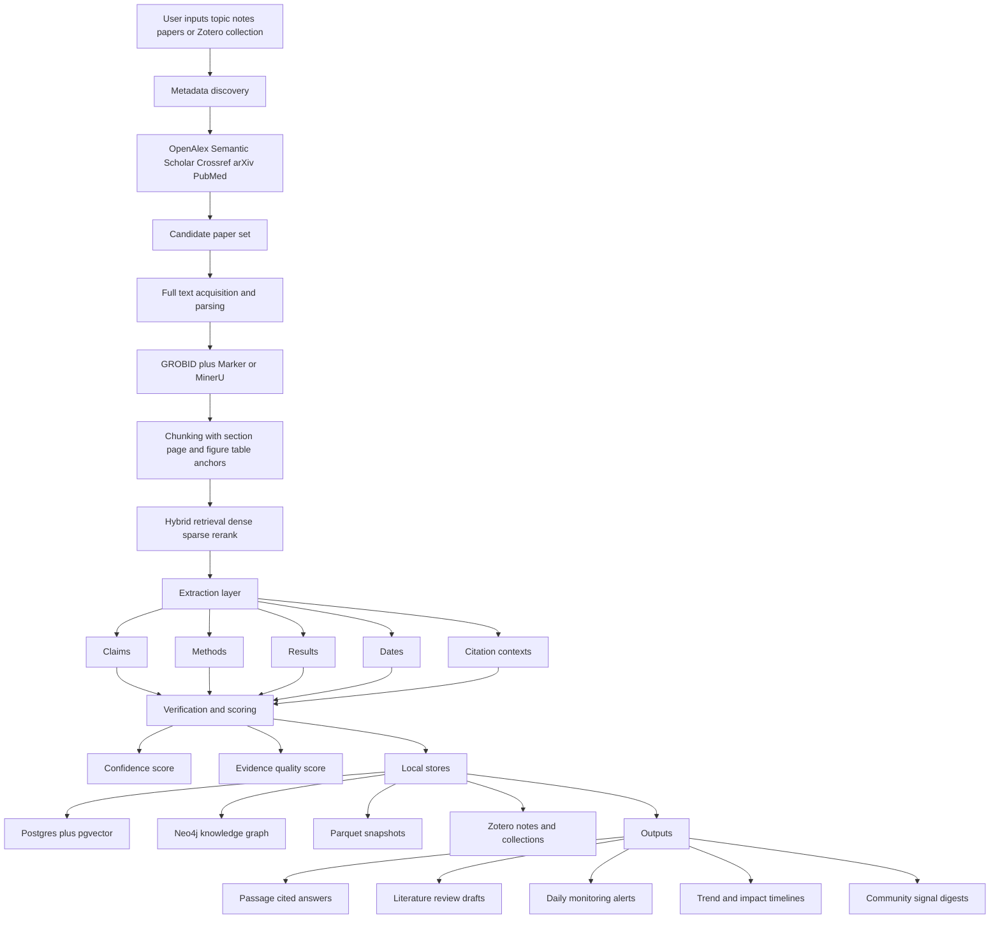
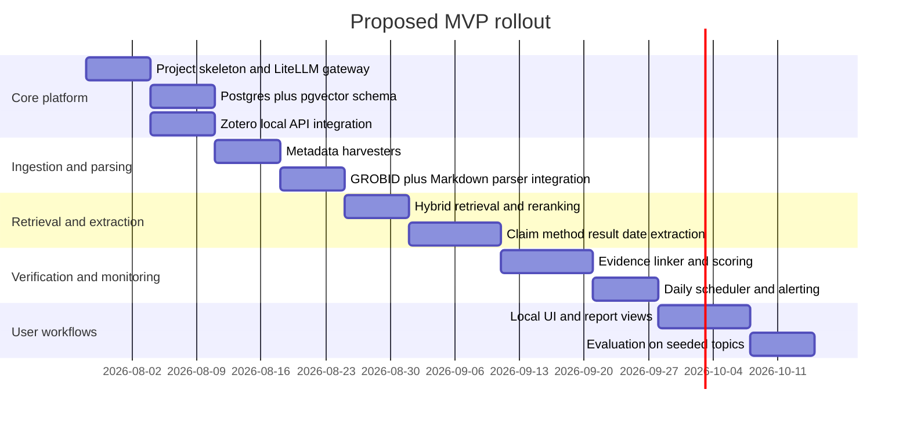

# Local-First AI Auto Researcher Landscape and MVP Blueprint

## Executive summary

The current landscape is mature enough to build a strong **literature-intelligence MVP**, but not yet mature enough to safely delegate the **entire academic research workflow** end to end without tight human control. The most credible building blocks are now available across three layers: scholarly discovery and metadata systems such as OpenAlex, Semantic Scholar, arXiv, Crossref, and PubMed; full-text parsing and document-structure tools such as GROBID, S2ORC-doc2json, MinerU, and Marker; and evidence-grounded research agents such as PaperQA2 and Zotero-centered assistants. Recent research also shows rapid progress in automated survey generation, scientific claim verification, temporal retrieval, and citation-intent analysis, but the same literature repeatedly highlights hallucinated references, weak evidence linking, and inconsistent evaluation as unresolved problems. citeturn15search0turn20search0turn20search2turn15search2turn20search1turn13view1turn14view4turn23search4turn23search1turn8search1turn32view4turn32view5turn34view0

For your use case, the strongest design choice is to **avoid the “AI scientist” trap** in the first MVP. Systems like Agent Laboratory, AI-Researcher, and AutoResearchClaw are valuable for architecture ideas, but they target broader autonomous research-generation loops, not the narrower and more reliable problem of “find papers, understand what people are doing, extract claims/methods/results/dates, monitor what changed, and cite every assertion.” By contrast, PaperQA/PaperQA2, Zotero-native agents, systematic-review automation tools, claim-verification datasets, and temporal IR work map directly onto your requirements. citeturn32view1turn32view2turn24view5turn32view3turn8search1turn13view4turn13view5turn13view3turn13view6turn32view6turn32view7turn34view0

The clearest market gap is an **integrated, local-first research operating system** that combines: Zotero-native ingestion; hybrid retrieval over full text and metadata; passage-level claim/evidence graphs; temporal monitoring of new papers and changing discourse; and a rigorous scoring layer that separates **model confidence** from **evidence quality**. Existing commercial tools are strong on search, synthesis, and alerts, but the reviewed products are predominantly SaaS and do not center a fully local-first architecture. Existing open-source tools are strong on local control, citations, and modularity, but they are fragmented across metadata retrieval, PDF parsing, library integration, systematic review, and agent orchestration. That fragmentation is your opportunity. citeturn29view6turn29view2turn29view4turn29view3turn30view3turn28view5turn28view1turn28view3turn27search4turn13view4turn13view5turn13view3turn13view0turn13view6turn14view1turn14view2

## Research literature

The literature most relevant to your project falls into five clusters: automated literature review and related-work generation, scientific QA over papers, scientific claim verification, scientific information extraction and representation, and temporal retrieval or impact analysis. Recent surveys are especially useful because they summarize not only architectures, but also the weak spots in benchmarking and evaluation. citeturn33view1turn33view0turn32view5turn34view0turn32view11

### Core papers and why they matter

| Paper | What it contributes | Why it matters for your MVP |
|---|---|---|
| **Related Work and Citation Text Generation: A Survey** citeturn33view1turn31search0 | Surveys extractive and abstractive related-work generation, datasets such as AAN, SciSummNet, Delve, S2ORC, and CORWA, plus evaluation practice. | Best starting point for literature-review automation because it links task framing, data, and metrics. |
| **Large language models for automated scholarly paper review: A survey** citeturn33view0 | Reviews LLM-based automated scholarly paper review, methods, datasets, code, online systems, and policy concerns. | Useful for “strict evidence review” and critique-generation modules, but better as a later feature than an MVP core. |
| **From Automation to Autonomy: A Survey on Large Language Models in Scientific Discovery** citeturn32view11 | Organizes work into LLM as Tool, Analyst, and Scientist. | Gives a useful autonomy ladder; your initial system should sit mostly in the “Tool/Analyst” zone. |
| **PaperQA** citeturn32view3turn8search21 | Defines an evidence-grounded workflow with search, gather-evidence, and answer tools over scientific papers. | Directly matches your requirement for passage-level citations and evidence-first synthesis. |
| **PaperQA2 / Language agents achieve superhuman synthesis of scientific knowledge** citeturn8search1turn8search13 | Reports strong performance for scientific QA, summarization, and contradiction detection across literature. | Gives an existence proof that evidence-grounded scientific agents can outperform expert baselines on some tasks. |
| **AutoSurvey** citeturn32view0 | Proposes an LLM pipeline for automatic survey generation. | Good for thematic-outline generation and scaffolded drafting, but should sit behind an evidence-verification gate. |
| **Large Language Models for Automated Literature Review: An Evaluation...** citeturn32view4turn36view4 | Evaluates reference generation, abstract writing, and review composition; emphasizes hallucinated references, factual consistency, and semantic coverage. | A key warning paper: generation quality is not enough; you must verify references and semantic coverage separately. |
| **SciFact** citeturn32view6 | Introduces scientific claim verification with support/refute labels and rationale selection over literature. | Strong benchmark and ontology for your claim/evidence layer. |
| **CliVER** citeturn32view7turn19search5 | Retrieval-augmented scientific claim verification in the clinical domain. | Shows how domain-specific retrieval plus evidence classification can be adapted to real research corpora. |
| **Claim Verification in the Age of Large Language Models** citeturn32view5turn36view2 | Surveys LLM-era claim verification pipelines: claim detection, evidence retrieval, rationale selection, veracity, explanation. | Helps define your internal pipeline stages and where to attach confidence scores. |
| **SciREX** citeturn32view8 | A document-level scientific IE benchmark for entity and relation extraction. | Strong reference for extracting structured knowledge from full papers rather than abstracts alone. |
| **SPECTER** citeturn32view9turn19search7 | Citation-informed document embeddings for scientific papers, plus SciDocs evaluation. | Important for semantic retrieval, related-paper discovery, and topic clustering. |
| **It’s High Time: A Survey of Temporal Information Retrieval and Question Answering** citeturn34view0 | Surveys temporal IR/QA, recency awareness, temporal robustness, and time-sensitive evaluation. | Essential for your daily monitoring and “time-aware” design requirement. |
| **In-depth Research Impact Summarization through Fine-Grained Temporal Citation Analysis** citeturn34view1turn32view10 | Proposes time-aware impact summaries using citation intents over time. | Very relevant to monitoring how a paper’s reception changes, not just how often it is cited. |
| **ClaimCheck** citeturn35view0 | A multimodal, claim-grounded peer-review resource linking reviewer weaknesses to paper claims. | Excellent inspiration if you later want auto-critique or peer-review mode. |
| **CLAIM-BENCH** citeturn35view2 | Benchmarks claim-evidence extraction and validation over scientific content. | Useful for evaluating your own evidence-linking stack. |
| **SciClaimHunt** citeturn35view3turn35view4 | Introduces larger scientific claim verification datasets, including numeral-aware claims. | Especially relevant if you want to reliably extract and verify quantitative results. |

A few older papers remain foundational. The related-work generation survey traces the formal task back to early work such as Hoang and Kan and later section-level summarization systems, while S2ORC, SciREX, SciFact, and SPECTER are still among the most reusable “infrastructure papers” because they define datasets, retrieval representations, and document-level scientific NLP tasks that many later systems quietly depend on. citeturn33view1turn8search2turn32view8turn32view6turn32view9

### What the literature says you should optimize for

The literature suggests that a strong academic research assistant should not be evaluated like a generic chatbot. Related-work and survey-generation work uses ROUGE, BLEU, METEOR, SciBERTScore, QuestEval, intent alignment, and extensive human judgments on fluency, coherence, relevance, usefulness, and factuality. Claim-verification work instead emphasizes evidence retrieval, rationale selection, support/refute classification, and explanation generation. PaperQA-style evaluation adds answer accuracy, precision conditioned on “sure” answers, and contradiction detection. Automated literature-review evaluation specifically highlights hallucination rate, factual consistency, and semantic coverage as distinct dimensions. citeturn36view0turn36view1turn36view2turn36view4turn36view5turn8search1

The biggest recurring lesson is simple: **generation is the easy part; grounded evidence alignment is the hard part**. Multiple sources show that LLMs can draft reviews, summaries, and critiques, but still struggle with fabricated references, incomplete evidence chains, and weak calibration. For your product, that means the “answer” should always be the final layer, not the central architecture. The central architecture should be **retrieval → parsing → claim extraction → evidence linking → scoring → only then synthesis**. citeturn32view4turn32view5turn32view3turn35view1turn35view2

## Open-source ecosystem

The open-source ecosystem is strong in components, weaker in integrated products. The most promising pattern is to combine one **scholarly RAG core**, one **PDF-structure extraction core**, one **metadata backbone**, one **Zotero-native interface**, and one **scheduler/orchestrator**. No single repository reviewed here covers all of that cleanly. citeturn13view0turn13view1turn14view4turn13view7turn13view4turn13view5turn13view3turn13view6

### Repositories worth studying first

| Repo | Description | Language | License | Activity signal | Key techniques | Install or run notes |
|---|---|---:|---|---|---|---|
| **Future-House/paper-qa** citeturn13view0turn26view7turn37view0 | High-accuracy RAG for scientific documents with citations. | Python | Not shown in the captured lines; packaged on PyPI. | 936 commits in the captured repo history. | Agentic search → evidence gathering → answer; local embeddings optional. | `pip install paper-qa>=5`; local embeddings via `pip install paper-qa[local]`. |
| **grobidOrg/grobid** citeturn13view1turn37view6 | Scholarly PDF parsing into structured XML/TEI with strong bibliographic extraction. | Java | Not shown in captured lines. | Long-running project; open since 2011 per README summary. | PDF structure parsing, citation/reference extraction, batch/web-service API. | Use the web-service API or Docker images; suitable as a local parsing server. |
| **allenai/s2orc-doc2json** citeturn14view4turn37view7 | Converts scholarly PDFs, LaTeX, and JATS to S2ORC-style JSON. | Python | Not shown in captured lines. | Mature utility tied to S2ORC. | GROBID-backed PDF-to-JSON, TEI-to-JSON, web service wrapper. | Requires Java and GROBID; includes `bash scripts/setup_grobid.sh` and `bash scripts/run_grobid.sh`. |
| **scitex-ai/openalex-local** citeturn13view7turn37view1 | Local OpenAlex database with offline search and MCP interface. | Python | Not shown in captured lines. | Actively documented; positioned as part of SciTeX. | Local SQLite + FTS5 over OpenAlex-scale metadata; Python/CLI/MCP interfaces. | `pip install openalex-local` or `pip install openalex-local[mcp]`; start MCP with `openalex-local mcp start`. |
| **yilewang/llm-for-zotero** citeturn13view4turn24view0turn26view1turn37view3 | Zotero-native research agent with passage-grounded answers and support for local/OpenAI-compatible backends, Codex, and Claude Code. | TypeScript-heavy Zotero plugin stack | License present in repo, type not visible in captured lines. | 1,441 commits and about 2.4k stars in the captured view. | Zotero reader integration, grounded citations, note export, Codex and Claude bridges. | Codex integration uses `npm install -g @openai/codex`; Claude bridge uses a companion adapter repo and `npm install`. |
| **dralkh/seerai** citeturn13view5turn24view1turn26view2turn37view4 | Zotero 9 plugin for chat, structured extraction, federated scholarly search, OCR, and PRISMA-style workflows. | TypeScript-heavy Zotero plugin stack | MIT | 553 commits and about 70 stars in the captured view. | Local-first design, OCR fallback, systematic-review workflows, MCP server. | Build from source with `npm install` and `npm run build`; install generated `.xpi` into Zotero. |
| **Quiet-Signals-Lab/RAG-Assistant-for-Zotero** citeturn13view3turn26view0 | Desktop semantic-search/RAG app over a Zotero library with source attribution and page-number citations. | Electron plus backend/frontend stack | Apache-2.0 | 161 commits and about 140 stars in the captured view. | Hybrid retrieval, BM25 + embeddings, cross-encoder re-ranking, metadata filters. | Designed for local or cloud LLMs; strongest fit if you want a standalone desktop researcher on top of Zotero. |
| **PouriaRouzrokh/LatteReview** citeturn13view6turn24view2turn26view3turn37view5 | Low-code multi-agent package for systematic literature review workflows. | Python | License present, type not visible in captured lines. | 117 commits and about 117 stars in the captured view. | Multi-agent screening, reviewer roles, scoring, batch processing, LiteLLM support. | `pip install lattereview`. |
| **CarinaSchoppe/PISMA-Literature-Review-Pipeline-Automation-Tool** citeturn14view1turn24view4turn26view5 | Pipeline for database search, citation expansion, relevance analysis, OA PDF download, and structured outputs. | Python-oriented research automation stack | GPL-3.0 | 135 commits and about 12 stars in the captured view. | Headless or guided runs, repeatable configs, citation-network expansion. | Save JSON configs and run headless from the CLI for repeatable systematic review jobs. |
| **aiming-lab/AutoResearchClaw** citeturn14view2turn24view5turn26view6 | Fully autonomous “idea to paper” framework with skills, agent backends, and multi-stage research automation. | Python-heavy with additional frontend and tool wrappers | MIT | 281 commits, about 13.9k stars, and explicit March 2026 release notes in README. | Multi-stage research workflow, skills library, support for Claude Code and Codex-compatible backends. | Best treated as an orchestration idea bank, not as the base for a strict evidence-first MVP. |
| **assafelovic/gpt-researcher** citeturn13view2 | Autonomous deep-research agent for web and local documents. | Python | Apache-2.0 | Large public repo; architecture explicitly separates planner and execution agents. | Planner/executor/publisher flow, source tracking, local+web research. | Useful architectural reference, though less academically specialized than the Zotero- and paper-centric tools above. |

### What the open-source ecosystem is missing

Open source is already good at **one thing at a time**: PaperQA is strong on answering with citations, GROBID on structure extraction, openalex-local on local metadata, and Zotero plugins on real researcher workflows. What is still missing is a clean, opinionated system that does **all** of the following together: local-first storage, daily monitoring, claim/method/result/date extraction, evidence graphing, evidence-quality scoring, temporal change tracking, and community-opinion mining. That integration gap is exactly where your product can differentiate. citeturn13view0turn13view1turn14view4turn13view7turn13view4turn13view5turn13view6turn14view1

## Commercial product landscape

Commercial products have converged on a common value proposition: speed up literature discovery, screening, synthesis, and staying current. They differ mainly in where they place their center of gravity. Elicit and Consensus emphasize research workflows and evidence synthesis; Scite emphasizes citation context and support versus contrast; Litmaps and ResearchRabbit emphasize graph-based discovery; Undermind emphasizes iterative co-research and alerts; Semantic Scholar remains a strong free backbone for discovery and notifications. citeturn29view6turn29view2turn29view4turn29view3turn30view3turn28view1turn28view3turn28view5turn27search4

### Product comparison

| Product | Notable strengths | Monitoring or time-awareness | Where it falls short for your goal |
|---|---|---|---|
| **Elicit** citeturn29view6turn29view2 | Searches papers, generates structured reports, and supports data extraction with quotes or figures from source documents. | Workflow is updated and report-oriented, but the reviewed pages do not emphasize daily autonomous monitoring as a first-class local feature. | Strong extraction and review UX, but not local-first. |
| **Consensus** citeturn29view4turn29view3turn10search5turn10search2 | Speeds up literature reviews by searching, screening, extracting, and synthesizing; supports deeper “Research Agent” workflows, filters, DOI lookup, citation crawling, and saved lists/export. | Has notifications when Deep Search finishes, plus saved lists and advanced filters. | Strong SaaS workflow, but not centered on local storage or passage-level claim graphs. |
| **Scite** citeturn30view3turn10search9turn10search1turn10search4 | Smart Citations with citation context and support/mention/contrast labels; report page supports qualitative and quantitative citation review. | New content is indexed daily according to help documentation. | Excellent citation-intent signal, but not a local-first research OS or a full paper-monitoring pipeline. |
| **Litmaps** citeturn28view0turn28view1 | Citation-network discovery, visual maps, collaboration, and automatic monitoring of new papers on a topic. | Monitoring is explicit and built into the product. | Great for discovery and keeping up, but weaker for extraction and verification. |
| **ResearchRabbit** citeturn28view3 | Visual exploration of literature and authors, organization, topic understanding, and Zotero-friendly workflows. | Emphasizes topic evolution and visual exploration over time. | Useful discovery interface, but less explicit on strict evidence extraction. |
| **Undermind** citeturn28view5 | Iterative co-research flow: clarify a need, search broadly, read/evaluate many papers, follow citation trails, verify statements with inline citations, and notify on important updates. | Monitoring and notifications are explicit. | Very close to your desired UX, but still primarily cloud product logic rather than local-first infrastructure. |
| **Semantic Scholar** citeturn20search0turn27search4turn27search10 | Strong free discovery backbone; API and datasets; influential-citation and paper-alert features. | Paper alerts are first-class. | Strong as a source and alerting layer, not sufficient alone for rigorous extraction workflows. |
| **SciSpace** citeturn29view0turn29view5 | Chat with PDFs, literature review agent, topic finding, citation generation, and data extraction against a large paper corpus. | The reviewed pages emphasize review workflows more than persistent monitoring. | Good interactive workspace, but less transparent as a local pipeline component. |
| **Connected Papers** citeturn9search5turn28view4 | Visual tool for finding and exploring relevant papers. | Less evidence from the accessible pages on formal alerting, but strong graph discovery. | Useful discovery modality, not enough for strict extraction or monitoring by itself. |

For **community and opinion mining**, the closest commercial analogs are not scholarly products but social-listening platforms. Talkwalker, Brandwatch, and Meltwater all emphasize always-on monitoring, sentiment analysis, trend tracking, influencer discovery, and alerts; GDELT provides a real-time open-data graph over global news and narrative signals. The implication is important: scholarly products are good at **evidence**, while social-listening tools are good at **discourse momentum**. Your system can fuse both, but it should never treat discourse sentiment as equivalent to scientific validity. Meltwater’s own documentation explicitly frames sentiment as a directional signal that should be validated with source-linked examples and trends over time. citeturn11search6turn11search8turn11search1turn11search3turn11search7

## Architecture patterns and evaluation norms

Across papers, repos, and products, a common architecture is emerging. It usually has six stages: ingest metadata and candidate documents; parse structure from full text; retrieve relevant sections with dense, sparse, or graph-aware search; extract claims, methods, results, and citation intents; score or verify against evidence; then generate user-facing outputs such as answers, reports, timelines, or alerts. Claim-verification surveys and scientific QA systems make this decomposition especially explicit, and successful commercial products increasingly map to the same pipeline even when their UX hides the internal stages. citeturn36view2turn32view3turn35view1turn29view4turn28view5

### Common technical patterns

| Capability | Common pattern in the sources | Representative sources |
|---|---|---|
| Scholarly discovery | Pull metadata and citation links from OpenAlex, Semantic Scholar, Crossref, arXiv, PubMed, and S2ORC-like corpora. | citeturn15search0turn20search0turn15search2turn20search2turn20search1turn8search2 |
| Full-text parsing | Convert PDFs into structured XML/JSON/Markdown, preserving headers, references, tables, and section boundaries. | citeturn13view1turn14view4turn23search4turn23search1turn23search2 |
| Retrieval | Use semantic embeddings, lexical retrieval, and re-ranking; sometimes add citation-graph or temporal signals. | citeturn32view9turn13view3turn34view0turn17search12 |
| Evidence-grounded QA | Separate search, evidence-gathering, and answer generation instead of prompting one giant model once. | citeturn32view3turn8search1 |
| Claim verification | Detect claims, retrieve evidence, select rationales, assign support/refute or related labels, then explain. | citeturn36view2turn32view6turn32view7turn35view2 |
| Citation-intent mining | Label citation contexts as supporting, contrasting, mentioning, or finer-grained intents. | citeturn30view3turn18search0turn31search2turn31search3 |
| Temporal monitoring | Store timestamps, query by update windows, and test recency awareness explicitly. | citeturn34view0turn15search10turn27search4turn28view1turn28view5 |
| Research-library integration | Keep notes, PDFs, annotations, and local library state synchronized through Zotero-compatible flows. | citeturn15search3turn13view4turn13view5turn13view3 |

A second pattern is the rise of **hybrid retrieval**. Repositories such as RAG Assistant for Zotero explicitly combine semantic embeddings with BM25 and cross-encoder re-ranking, while Qdrant now supports hybrid dense, sparse, and formula-based ranking with local mode, and pgvector lets you keep vectors in Postgres next to the rest of your structured data. For a local-first MVP, this strongly suggests that you should not begin with a pure vector database approach. Start with **hybrid retrieval** as a design principle from day one. citeturn13view3turn17search12turn17search13turn16search2

A third pattern is that **time-awareness must be explicit**, not assumed. Temporal IR work stresses temporal intent detection, normalization of time expressions, ordering of events, and evaluation for recency awareness and generalization. Crossref exposes date-based filtering; Semantic Scholar has alerts; Litmaps and Undermind expose automatic monitoring; and temporal citation papers show that impact itself can be summarized as an evolving sequence rather than a scalar count. This is directly relevant to your requirement that sources be handled “with time awareness.” citeturn34view0turn15search10turn27search4turn28view1turn28view5turn34view1

### Evaluation metrics you should adopt

A serious MVP should track at least four score families, because the literature repeatedly shows that one family alone gives a distorted picture. First, for retrieval, track recall@k, hit rate on gold evidence, nDCG or MRR, citation coverage, and temporal freshness. Second, for extraction and verification, track claim extraction precision/recall/F1, evidence-span precision/recall, label accuracy, rationale overlap, and numeric consistency for quantitative claims. Third, for synthesis, track semantic coverage, factual consistency, hallucination rate, and human ratings for coherence and usefulness. Fourth, for user-facing research QA, track answer accuracy, “sure-answer” precision, contradiction detection, and calibration error between confidence and actual correctness. citeturn36view0turn36view1turn36view4turn36view5turn35view2turn35view3

For your system specifically, I recommend separating **confidence** from **evidence quality**. Confidence should be a model-and-pipeline score: retriever agreement, re-ranker margin, extractive overlap, model self-consistency, and verification agreement. Evidence quality should be a source-and-evidence score: whether the evidence is from full text or only abstract, whether it is direct or inferential, whether the work is peer reviewed, whether the claim is backed by a table/figure or only narrative text, and whether the evidence is recent and replicated. This separation is an inference from the literature and product patterns, but it is strongly supported by the way claim-verification systems separate evidence retrieval from final veracity labeling, and by how review-generation work separately measures hallucination, factual consistency, and semantic coverage. citeturn36view2turn32view6turn32view7turn36view4

## Gaps and MVP opportunities

The first major gap is **strict local-first evidence workflows**. Zotero-centered open-source tools now come surprisingly close, but they still split core functions across different projects: one project grounds answers in citations, another does library integration, another does systematic review, another does metadata caching, and another does PDF extraction. Commercial tools, by contrast, unify the experience but generally keep the system in the cloud. That leaves space for a personal, local-first assistant that feels as integrated as Undermind or Elicit while preserving the architecture and inspectability of PaperQA, GROBID, openalex-local, and Zotero-native plugins. citeturn13view0turn13view7turn13view4turn13view5turn13view6turn29view6turn28view5

The second gap is **claim-native monitoring instead of paper-native monitoring**. Most tools monitor new papers, citations, or topic maps. Very few monitor the evolution of specific claims, methods, datasets, or numerical results over time. Temporal citation analysis and scientific claim verification research suggest a better UX: let the user subscribe not only to “quantum error correction,” but also to structured propositions such as “surface code threshold estimates,” “new compilation methods for NISQ circuits,” or “GPU-aware LLM inference for HPC,” then show what changed in evidence quality, direct support, critique, and community attention over time. citeturn34view1turn32view6turn32view7turn35view3turn34view0

The third gap is **evidence-linked opinion mining across scholarly and community sources**. Citation sentiment analysis and smart-citation systems help interpret scholarly reception, while social-listening tools capture attention, controversy, and framing across the web. But these worlds are barely connected. An MVP opportunity is to attach discourse summaries to claim graphs: “supporting scholarly evidence is increasing, while community discussion is polarized,” or “community excitement is rising faster than peer-reviewed confirmation.” That would be far more useful than generic sentiment dashboards, provided you keep academic evidence and public opinion in explicitly separate channels. citeturn30view3turn18search0turn11search6turn11search8turn11search1turn11search3turn7search19

The fourth gap is **figure and table grounding**. Elicit explicitly markets extraction from tables and figures with source support, and recent claim-verification research is starting to expand beyond plain text, but most open-source research-assistant stacks still focus on narrative text. For quantum computing, HPC, and AI, many high-value findings live in plots, benchmark tables, ablation tables, or hardware-configuration appendices. So multimodal extraction is not a “nice to have”; it is a domain requirement. citeturn29view2turn23search4turn23search2turn35view0turn18search3

## Proposed local-first MVP blueprint

The best MVP for you is not a monolith. It is a **layered local research engine** with five persistent stores and two orchestration loops. The stores are: local file storage for PDFs/Markdown/JSON/Parquet; a relational store for canonical entities and jobs; a vector layer for semantic retrieval; a graph layer for citations and claims; and a Zotero-compatible library view. The loops are: an interactive “ask/explore/extract” loop and a scheduled daily “monitor/enrich/re-score/notify” loop. This is the most direct synthesis of the component landscape you asked for. citeturn15search3turn16search2turn17search1turn17search2turn22search2turn22search6turn22search0turn22search5

### Proposed stack

| Layer | Recommended choice | Why this is the best MVP fit |
|---|---|---|
| Metadata harvest | **OpenAlex + Semantic Scholar + Crossref + arXiv + PubMed** citeturn15search0turn20search0turn15search2turn20search2turn20search1 | Covers broad scholarly metadata, citations, preprints, and biomedical depth. |
| Local metadata cache | **openalex-local** first, with raw snapshots or incremental pulls into your DB citeturn13view7turn37view1 | Lets daily monitoring happen locally and cheaply at scholarly scale. |
| Full-text parsing | **GROBID** as the structural backbone; add **Marker** or **MinerU** for Markdown/table/image recovery citeturn13view1turn37view6turn23search1turn23search4 | GROBID is dependable for structure; Marker/MinerU are helpful for table, image, and Markdown-centric downstream tasks. |
| Structured paper JSON | **S2ORC-doc2json** style internal schema citeturn14view4turn8search2 | Keeps sections, references, and parsed full text in a research-friendly format. |
| Primary relational DB | **PostgreSQL + pgvector** citeturn16search2turn22search23 | Simplifies local-first deployment by keeping entities, jobs, scores, and embeddings in one durable system. |
| Analytics sidecar | **DuckDB over Parquet exports** citeturn22search2turn22search6 | Excellent for local trend analysis, snapshots, and reproducible offline studies. |
| Knowledge graph | **Neo4j** citeturn17search2turn17search1turn17search5 | Best for paper–author–claim–method–result–dataset relationships and temporal/path queries. |
| Vector retrieval | Start with **pgvector**, add **Qdrant** only if you need independent dense+sparse+formula search service behavior citeturn16search2turn17search12turn17search13turn17search3 | This keeps the MVP simple while preserving an upgrade path. |
| Library integration | **Zotero local API** plus export/sync pathways citeturn15search3turn15search7 | Matches your local-first requirement and existing academic workflow. |
| Multi-model gateway | **LiteLLM** in front of Anthropic, OpenAI, and local OpenAI-compatible backends citeturn16search3turn16search0turn16search10 | Gives one interface for Claude Code, Codex, local models, and future providers. |
| Developer surfaces | **Claude Code**, **Codex**, and **Cursor MCP** citeturn21search0turn21search16turn21search1turn21search2turn21search14 | Best fit for building and operating an agentic local research system with tools and skills. |
| Scheduler | **APScheduler + systemd timers** for MVP; **Temporal** later if you need durable long-running workflows citeturn22search0turn22search4turn22search5turn6search17turn6search21 | Minimizes operational complexity now; preserves a path to durable execution later. |

### Integration patterns

The cleanest integration pattern is to use **LiteLLM as the runtime abstraction**, not as the product logic. That means your product calls a single internal “model gateway,” while routing tasks to different models based on job type. Retrieval query transformation, plan generation, and code-oriented reasoning can go to Claude Code or Codex-backed flows; extraction jobs can route to a cheaper structured-output model; final synthesis can go to your best reasoning model; and local open-source models can handle note classification, deduplication, or background clustering. LiteLLM is designed precisely to normalize provider differences behind an OpenAI-style interface. citeturn16search3turn16search10turn21search0turn21search1

A second integration pattern is to treat **Zotero as the user-facing library of record**, but not the only store. Zotero should remain the canonical UX for PDFs, notes, collections, and bibliographic export, while PostgreSQL stores normalized entities, pgvector stores embeddings, Neo4j stores graph relationships, and Parquet snapshots feed analytics. This lets you stay compatible with normal academic workflows without forcing Zotero to do graph analytics or high-volume retrieval work that it was not designed for. Zotero’s local API explicitly supports code running on the user’s computer against the local database. citeturn15search3turn15search7turn13view4turn13view5turn13view3

A third integration pattern is to make **every extracted assertion traceable to a passage object**. In practice, this means that your internal schema should never store only “claim text.” It should store: source paper ID, section, paragraph or chunk ID, character span or page anchoring, extraction model, retrieval context, linked evidence spans, and derived score objects. That pattern is consistent with PaperQA’s evidence objects, SciFact rationales, Scite’s citation-context model, and claim-verification pipelines more broadly. citeturn32view3turn32view6turn30view3turn36view2

### Proposed data model

At minimum, your knowledge graph should include these entity types: `Paper`, `Version`, `Author`, `Venue`, `Topic`, `Claim`, `Method`, `Result`, `Dataset`, `Metric`, `Figure`, `Table`, `CodeRepo`, `Product`, `CommunitySource`, `CitationContext`, and `Alert`. Core relations should include `CITES`, `SUPPORTS`, `REFUTES`, `MENTIONS`, `USES_METHOD`, `REPORTS_RESULT`, `EVIDENCE_FOR`, `SIMILAR_TO`, `DISCUSSED_IN`, `OBSERVED_ON`, and `UPDATED_BY`. This is a proposed synthesis, but it follows directly from scientific IE datasets, citation-intent work, temporal citation analysis, and the practical requirements of Zotero and local discovery products. citeturn32view8turn30view3turn34view1turn13view4turn13view5turn13view3

### Minimal API examples

These examples show the right level of granularity for an MVP: one scholarly metadata query, one local library query, and one multi-model gateway call. The point is to keep the infrastructure boring and inspectable.

```bash
# OpenAlex: recent works on quantum error correction
curl "https://api.openalex.org/works?search=quantum%20error%20correction&filter=from_publication_date:2026-01-01&per-page=25"
```

```bash
# Zotero local API: read local items from the desktop client
curl "http://127.0.0.1:23119/api/users/0/items?limit=25"
```

```python
# LiteLLM: one interface, many providers
from litellm import completion

resp = completion(
    model="anthropic/claude-sonnet-4-20250514",
    messages=[
        {
            "role": "user",
            "content": (
                "Extract claims, methods, results, dates, and evidence spans "
                "from this paper chunk as strict JSON."
            ),
        }
    ],
)
print(resp["choices"][0]["message"]["content"])
```

These patterns are grounded in the official OpenAlex, Zotero, LiteLLM, Claude Code, Codex, and Cursor/MCP documentation. citeturn15search0turn15search3turn16search3turn21search0turn21search1turn21search2

### Proposed MVP flow



### Proposed rollout timeline



### Prioritized next steps

Your best immediate move is to study **PaperQA2**, **SciFact**, **CliVER**, **SPECTER**, **S2ORC**, and the **Related Work and Citation Text Generation** survey first. Together, these give you the foundations for evidence-grounded QA, scientific claim verification, scientific retrieval embeddings, corpus design, and review-generation evaluation. If you only read six items before writing code, read those six. citeturn8search1turn32view6turn32view7turn32view9turn8search2turn33view1

For repositories, the highest-return reading order is: **paper-qa** for evidence-grounded agent design; **llm-for-zotero** and **seerai** for Zotero-native UX and local workflow ideas; **grobid** and **s2orc-doc2json** for parsing; **openalex-local** for large local metadata search; and **LatteReview** for systematic-review automation patterns. **AutoResearchClaw** is worth reading later for orchestration and skills, but it is too broad to be your architectural center of gravity in the first version. citeturn13view0turn13view4turn13view5turn13view1turn14view4turn13view7turn13view6turn14view2

If I were prioritizing the actual build, I would sequence it this way. First, implement **local ingestion and evidence-grounded QA** over a Zotero collection. Second, add **structured extraction** of claims, methods, results, and dates. Third, add **daily monitoring** over OpenAlex, Semantic Scholar, arXiv, and Crossref update windows. Fourth, add **evidence and confidence scoring**. Fifth, add **claim-centric temporal digests**. Only after those are stable would I add community-opinion mining and broader autonomy. That ordering aligns with the technical maturity of the components and with the failure modes documented in the literature. citeturn15search0turn20search0turn20search2turn15search2turn13view4turn13view5turn13view0turn32view4turn32view5turn34view0

The bottom line is that your project should not try to be “an AI scientist” first. It should try to become **the most trustworthy local research memory and evidence engine for one serious researcher**. The sources reviewed here strongly suggest that this narrower target is both more feasible and more valuable—and that it can later expand into proposal drafting, critique generation, and broader autonomous workflows once your evidence layer is solid. citeturn32view11turn32view1turn32view2turn32view3turn30view3turn36view2